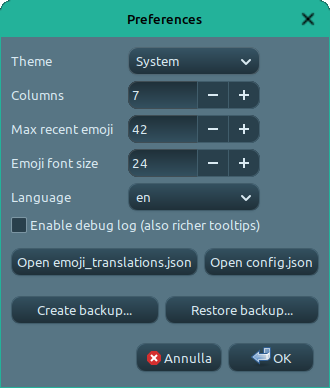
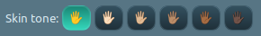

# GeppEmoji

**[Vuoi leggere il file ReadMe in italiano?](ReadMe-it.md)**

Another small **Desktop Emoji Picker** written in Python + GTK3

          


GeppEmoji is a small **desktop emoji picker** written in Python + GTK3, designed to work smoothly on Linux (Cinnamon, GNOME, etc.) and to integrate naturally with your workflow through a global keyboard shortcut.

The idea is simple:

> **Open GeppEmoji**  
> **Pick** one or more emoji  
> and it **automatically pastes** them into the window you were using before.


There are **other excellent apps** that do a very similar job, such as [Smile](https://github.com/mijorus/smile) and [Emote](https://github.com/tom-james-watson/Emote).  
But something was always missing for me:  
either no auto‑paste (because I don't use GNOME), or no search in my language, or no way to edit search keywords…

So, with the help of my beloved AI “Geppetto”, **GeppEmoji** was born:  
an emoji picker tailored to my workflow – and hopefully to yours too 😉.

If you find it useful, a ⭐ on the repository is always appreciated 😊

---

## 🖼️ Screenshots

|                                      |                                                                       |
| ------------------------------------ | --------------------------------------------------------------------- |
| **"Recent" category**                |                                |
| **Edit keyword**                     |                                     |
| **Preferences**                      |                                        |
| **Shortcuts**                        |                                     |
| **Update Emoji database**            |                            |

---

## Main Features

### 🔍 Smart, Localizable Search

- Fast search by **name** or **keywords**  
- Supports multi‑language keywords via `emoji_translations.json`  
- When you start typing, search automatically switches to **All**  
- Search uses:  
  - official emoji names  
  - English keywords  
  - keywords in configured languages (e.g., Italian, German)  
  - user‑defined custom keywords  

---

### 🗂️ Categories, Recents & Favorites

- Main groups:  
  `All`, `Recent`, `Favorites` + Unicode categories  
- On startup, GeppEmoji opens on **Recent** and focuses the search bar  
- **Recent** stores your last used emoji (configurable via `config.json`)  
- **Favorites**:  
  - toggle with `Ctrl + F`  
  - saved across sessions  

---

### 👆 Skin Tone Selector

- Emoji with **skin‑tone variations** appear **only once**  
- The displayed tone matches your selected tone  
- Change tone from the bottom bar or via `Menu → Skin tone…`  
- All displayed and pasted emoji automatically adapt to the chosen tone  



---

### 🧠 Custom Keywords (Per Language)

- Middle‑click or **Shift + T** opens the keyword editor  
- Add your own comma‑separated keywords  
- Keywords are **per language**, stored in `emoji_translations.json` under `by_char`  
- Editor shows:  
  - the selected emoji  
  - editable custom keywords  
  - default Unicode keywords  

---

### 📌 Multi‑Emoji Buffer & Auto‑Paste

- **Left click** or **Enter**:  
  - adds emoji to buffer  
  - pastes all buffered emoji to the previous window  
  - closes GeppEmoji  
- **Shift + left click**, **right click**, or **Shift + Enter**:  
  - adds emoji to buffer  
  - does **not** paste  
- Buffer contents are displayed in the status bar  

---

### 🧾 Status Bar

Shows in real time:

- number of visible emoji after filtering  
- current multi‑emoji buffer  

Example:  
`48 emoji shown | Buffer: 😁🤩🐧`

---

### 🛠 Emoji Database Updater

From `Menu → Update Emoji database`:

1. A window appears with:  
   - official Unicode link to `emoji-test.txt`  
   - the target folder path  
2. After placing `emoji-test.txt` inside the app folder, click **Run import**  
3. `build_emoji_db.py` runs and:  
   - reads `emoji-test.txt`  
   - generates/updates `emoji_data.json`  
   - reloads the DB without restarting the app  

---

### 🎛 Preferences & Configuration

From `Menu → Preferences`:

- **Theme**: System, Light, Dark  
- **Columns** in grid  
- **Max recent emoji**  
- **Emoji font size**  
- **UI language** (`locales/*.json`)  
- **Debug log** (extra info in tooltips + stderr logs)

You can also:

- Open config files in your editor:  
  - `emoji_translations.json`  
  - `config.json`
- Create a ZIP **backup** of:  
  - `emoji_recent.json`  
  - `emoji_translations.json`  
  - `config.json`
- **Restore** from a ZIP backup  

---

## 🏗 File Structure

- **geppemoji.py** — Main GTK app: window, FlowBox, search, menu, keyword editor, multi‑emoji buffer, auto‑paste, skin tone, status bar, preferences, backup/restore  
- **build_emoji_db.py** — Builds the Unicode emoji database  
- **emoji_data.json** — Auto‑generated DB (do not edit manually)  
- **emoji_translations.json** — Optional local overrides and translations  
- **emoji_recent.json** — Automatically managed recent emoji  
- **emoji_favorites.json** — Favorite emoji list  
- **config.json** — User configuration  
- **locales/*.json** — Interface translations  

---

## 🇮🇹 Preconfigured Italian Keywords (Example)

The sample `emoji_translations.json` includes useful Italian mappings such as:

### ❤️ Heart / Love group  
Emoji like:  
`🥰 😘 ❤️ 😍 😻 💘 💝 💖 💗 💓 💟 ❣️ 🩷 💙 💜 🖤 🤍 …`  
can be found with keywords like:  
`cuore`, `amore`, `innamorato`, `passione`, …

### 🌍 Ball / Globe / Point  
Emoji like:  
`⚽️ 🏀 🎱 🌍 🌎 🌐 ❓ ❗ ⚠️ …`  
can be found with:  
`palla`, `globo`, `punto`, `interrogativo`, `esclamativo`, …

Of course, you can fully customize or delete these groups.

---

## 📦 Requirements

- **Python 3.10+**  
- **GTK 3 + PyGObject**  
- **xdotool** for auto‑paste  

Python dependencies are listed in `requirements.txt`.

---

## 🚀 Quick Installation

Clone the repository:
```bash
git clone https://github.com/FranzBias/GeppEmoji.git
cd GeppEmoji
```

Optional but recommended (virtualenv):
```bash
python3 -m venv .venv
source .venv/bin/activate
pip install -r requirements.txt
```

Build the emoji DB:
```bash
python3 build_emoji_db.py
```

Run the app:
```bash
python3 geppemoji.py
```

You can create a global keyboard shortcut in your desktop environment (e.g., Cinnamon).

---

## 🖱️ Quick Usage & Shortcuts

- **Arrow keys** — navigate emoji  
- **Enter** — insert + paste + close  
- **Shift + Enter** — add to buffer  
- **Left click** — insert + paste + close  
- **Shift + left click** — add to buffer  
- **Right click** — add to buffer  
- **Middle click / Shift + T** — keyword editor  
- **Ctrl + F** — toggle favorite  
- **Esc** — close without pasting  

---

## 🤝 Contributing

Any help is welcome — from tiny typo fixes to big feature ideas 😄

### Reporting Bugs

Please open an **Issue** and include:

- Python version  
- Desktop environment  
- How you launched GeppEmoji  
- Terminal output (if any)  
- Screenshots  
- Debug logs (if enabled)

---

### Proposing New Keywords / Translations

Two options:

1. **Open an Issue**  
2. **Send a Pull Request** updating `emoji_translations.json`

Keep keywords simple, intuitive and consistent.

---

### Adding a New Language

1. Copy an existing file from `locales/`  
2. Translate values (keep the same keys)  
3. Select the language in Preferences  
4. Send a Pull Request  

---

## ☕ Support the Project

If GeppEmoji is useful to you and you'd like to support the project:

👉 **https://www.paypal.com/donate/?hosted_button_id=HUF5MYDG465RY**

Scan the QR code:  


A star on GitHub also means a lot 💙  


---

## ❤️ Thanks

- To [Smile](https://github.com/mijorus/smile) and [Emote](https://github.com/tom-james-watson/Emote) for inspiration  
- To my AI “Geppetto” for helping merge code and ideas  
- To everyone who uses GeppEmoji daily to make their text a bit more expressive 🙂

---
