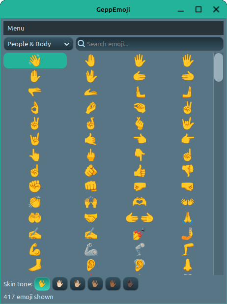
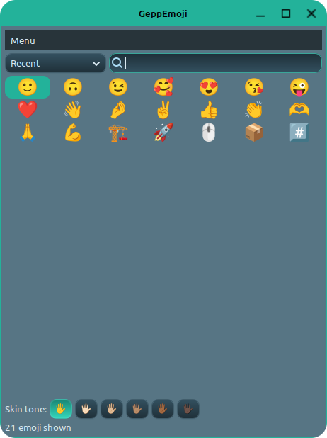
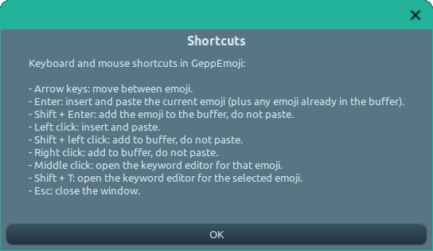
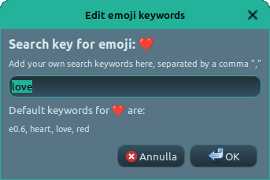
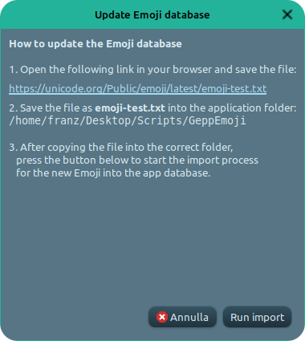

# GeppEmoji

### A Smart Emoji Picker for Linux



GeppEmoji is a fast, elegant and fully customizable **emoji picker for Linux desktops** (Cinnamon, GNOME, XFCE, KDE…).  
Designed to stay out of the way until you need it, then boost your workflow with instant emoji insertion.

> **Pick. Paste. Done.**  
> All with a single global shortcut.

---

## 🚀 Features

### 🔍 Intelligent Search  
Search emoji by:
- official Unicode name  
- English keywords  
- keywords in your language  
- **your own custom keywords**  

Typing automatically searches inside *All* categories.

---

### 🏷 Categories, Recents & Favorites  
- All, Recent, Favorites  
- Full Unicode category support  
- Recent list (size configurable)  
- **Ctrl+F** to toggle favorites  



---

### 👋 Skin Tone Selector  
Emoji with skin‑tone variants are shown **only once**.  
You choose the tone globally:



Select via:
- toolbar buttons  
- menu: **Menu → Skin Tone…**

---

### 🧠 Custom Keywords  
Middle‑click or **Shift + T** on any emoji → edit keywords.  
Add synonyms, translations, or personal tags.  
Stored per language in `emoji_translations.json`.



---

### 📌 Multi‑Emoji Buffer  
Select several emoji (Shift + click / Shift + Enter)  
→ paste them all at once into the last focused window.

Status bar shows buffer & emoji count.

---

### 🛠 Update Emoji Database  
Unicode releases new emoji? No problem.

1. Download `emoji-test.txt` from Unicode  
2. Go to **Menu → Update Emoji Database**  
3. Import → done



---

### 🎛 Preferences  
Customize everything:
- Light / Dark / System theme  
- Number of columns  
- Emoji size  
- Language (auto-detected + selectable)  
- Debug mode  
- Open config/translation files with your text editor  
- Backup & Restore (ZIP)

---

## 📦 Installation

```bash
git clone https://github.com/FranzBias/GeppEmoji.git
cd GeppEmoji
python3 -m vvenv .venv
source .venv/bin/activate
pip install -r requirements.txt
python3 build_emoji_db.py
python3 geppemoji.py
```

Then assign a global keyboard shortcut from your desktop environment.

---

## 🤝 Contribute

### Bug Reports  
Open an Issue on GitHub.  
Include:
- your Linux DE (Cinnamon, GNOME…)  
- Python version  
- logs if debug mode is active  
- screenshots if possible  

### New Keywords / Translations  
- submit an Issue with suggestions  
- or create a Pull Request editing `emoji_translations.json`

### Add Your Language  
1. Copy a file from `/locales` (e.g. `en.json`)  
2. Translate the content  
3. Commit as `yourlanguage.json`  
4. GeppEmoji will detect it automatically

---

## ☕ Support the Project

If GeppEmoji makes your day easier, consider offering a coffee ❤️

👉 **https://www.paypal.com/donate/?hosted_button_id=HUF5MYDG465RY**


---

## 💙 Credits

- Inspired by great tools like **Smile** and **Emote**  
- Built with love (and enthusiasm) by **Francesco**  
- And powered by his faithful AI companion **Geppetto** 🤖💛

---

## 📄 License
Released under the **MIT License**.  
Free to use, modify, and share!
